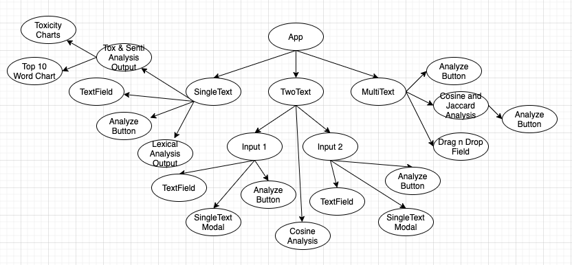

# Design 

## Class Diagrams 

#### Single Text Class Diagram by Bryan Kwong:

  

#### Two Text Class Diagram by Steven Gandham: 

  

#### Multi Text Class Diagram by Daniel Tisdale 

  

## SonarCloud Analysis

The link to the SonarCloud analysis is [here](https://sonarcloud.io/dashboard?id=bfkwong_SpeechBuddyJS). If the link is broken, the url is (https://sonarcloud.io/dashboard?id=bfkwong_SpeechBuddyJS)

## Design Patterns

### 1. Stateful Behavioral Pattern (see https://en.wikipedia.org/wiki/State_pattern) 

We used the stateful behavioral pattern in the program via the state hooks in ReactJS. With this design pattern, we want to ensure that there is a single source of truth for all information (this single source of truth is the state stored in src/App.js). From this absolute state, it determines all other behaviors of the page. 

For example, in the SingleText analysis page, the state contains the text that entered into the text area by the user. From that state, other components on the page determines what to do with that text, whether be it lexical analysis, or sentiment & toxicity analysis. 

The benefit of this design pattern is so that there will only be one source of "singular truth" in the App's state. This pattern ensures that whatever analysis is going on between the different components, they are all analyzing the same text from the App's state. 

### 2. Composite Pattern (see https://en.wikipedia.org/wiki/Composite_pattern)

The other design pattern that we used was the Composite pattern. In this design pattern, we used React components to partition the App into a tree-like structure. The component tree looks as follows. 

  

The benefits of this design pattern is so that we can interface with the SingleText, TwoText, and MultiText pages in the same way, and so forth, all the way down to the button level. This design pattern simplifies the logic of the code and avoids having to write dedicated code for the App's interaction with SingleText, TwoText, and MultiText pages.

An additional benefit of this design pattern is that all of these components are reusable. On example is when you go to the TwoText analysis page and run the analysis on a single text, it is the same component from the SingleText analysis page. The reusability of these components such as the buttons, text boxes, and most impressively the analysis display, is the most beneficial feature of this design pattern.
